# Trace Master Review — Peztold Paint

**Status:** Post-refactor review (Interaction + layers + history + controller split)  
**Related docs:** [tool-event-parity-matrix.md](tool-event-parity-matrix.md) (historical parity baseline), [code-review-plan.md](code-review-plan.md) (original review scope)

This document merges **Traces A–H** and synthesis **Trace G** into one source of truth: architecture, prioritized bugs, deep-dives, fix waves, a manual test checklist, and **one** end-to-end function flowchart at the end.

---

## 1. Introduction

### Purpose

Traces A–H walked every major user path (mouse, keyboard, menus, panels, file I/O) through the refactored stack: `controller.c` → `tools.c` → per-tool handlers → `interaction.c` → `layers.c` / `history.c`. This review records **what works**, **what regressed** vs the parity matrix, and **what to fix** in priority order.

### Trace map

| Trace | Scope |
| ----- | ----- |
| **A** | Freehand family (pencil/brush/eraser/airbrush), Alt+eyedropper, capture-lost |
| **B** | Toolbar/layers/undo/Escape/document/context/scroll during draw |
| **C** | Selection, clipboard, arrow nudge, context menu |
| **D** | Shapes, polygon, bezier, pen/highlighter/crayon, text, fill, magnifier, pick |
| **E** | Resize handles, zoom/scroll, paint path, colorbox, layout, status bar |
| **F** | Layers draft, history, image transforms, commit bar, interaction invariants |
| **G** | Cross-trace synthesis, adversarial G1–G10, master priority table, test checklist |
| **H** | File I/O, save/open, drag-drop, selection clipboard formats |

---

## 2. Architecture primer

Every traced path crosses up to five layers:

1. **HWND routing** — [src/main.c](../../src/main.c) (`WndProc`, `ResizeLayout`, `WM_DROPFILES`, `WM_CLOSE`), child windows (toolbar, canvas, colorbox, layers/history panels).
2. **Canvas controller** — [src/core/controller.c](../../src/core/controller.c) (bitmap coords, clamp, sub-stepped move, resize handles, wheel, keys, status bar sampling).
3. **Tool dispatch** — [src/core/tools.c](../../src/core/tools.c) (`ResolveActiveToolForMouseDown` / `ResolveActiveToolForMoveUp`, `s_runtime.capturedWindow`, `ToolCancel` vs `Tool_FinalizeCurrentState`).
4. **Interaction hub** — [src/core/interaction.c](../../src/core/interaction.c) (stroke session, draft merge on commit, capture-lost history).
5. **Persistence** — [src/core/layers.c](../../src/core/layers.c), [src/core/history.c](../../src/core/history.c), [src/core/file_io.c](../../src/core/file_io.c).

### Interaction vs tool lifecycle APIs

| API | History | Document dirty | Pixels |
| --- | ------- | -------------- | ------ |
| `Interaction_Commit` | Push if `modified` or draft | **Always today (BUG-008)** | Merge draft → active |
| `Interaction_OnCaptureLost` | Push if `modified` or draft | **Always today (BUG-008)** | Same |
| `Interaction_Abort` | No | No | Clear draft only |
| `Interaction_EndQuiet` | No | If modified | Keep active-layer writes |
| `ToolCancel` | Tool-specific abort | Usually no | Usually discard in-progress |
| `Tool_FinalizeCurrentState` | Deactivate hooks (text commit, selection commit) | Varies | Commits modal state |

### Win32 capture rule (critical for Traces B, G)

Only **one** HWND holds mouse capture per thread. While the canvas owns capture during a stroke, the toolbar and layers list **do not receive** mouse messages. Many “mid-stroke UI” bugs only appear after mouse-up, when switching layers, or when capture is stolen externally (`WM_CAPTURECHANGED`).

---

## 3. Master bug register

| ID | Sev | Traces | Symptom | Root cause | Fix (summary) | Test |
| --- | --- | ------ | ------- | ---------- | ------------- | ---- |
| **BUG-001** | High | B, G1, F | Stroke continues on wrong layer after layer list click | `HandleLayerSelection` omits `Tool_FinalizeCurrentState` | Call `Tool_FinalizeCurrentState()` before `LayersSetActiveIndex` | B checklist #7 |
| **BUG-002** | High | A, F, G | Second mouse button during stroke corrupts interaction | No guard in `FreehandTool_OnMouseDown`; `Interaction_Begin` overwrites state | If active and different button → `CancelFreehandDrawing()`; guard re-entrant `Begin` | A #2 |
| **BUG-003** | High | C, H, G | Paste not undoable; undo desyncs floating UI | `SelectionPaste` no `HistoryPush`; undo skips selection cancel | `HistoryPushSession` after paste; clear selection on undo | C #13 |
| **BUG-004** | High | B, G10, F | New doc leaves floating selection / pending tools | `DocumentNew` only `ResetToolStateForNewDocument` | `ToolSession_ClearAllPending` + `SelectionClearState` before `LayersInit` | B #12 |
| **BUG-005** | High | E, G8, F | Resize via Attributes breaks selection | `ImageAttributes` → `ResizeCanvas` without selection handling | Commit/clear selection; clamp float bounds | E #25 |
| **BUG-006** | High | F, G3 | History list jump desyncs tools vs pixels | `HandleHistorySelection` → `HistoryJumpTo` with no `ToolCancel` | `ToolCancel(INTERRUPT, TRUE)` before jump | F #28 |
| **BUG-007** | High | H, C | Paste from apps using `CF_BITMAP` fails | `CanPasteFromClipboard` checks `CF_BITMAP`; `SelectionPaste` ignores it | Implement `CF_BITMAP`/`CF_DIB` paste or narrow menu enable | H paste test |
| **BUG-008** | Med | F, D4 | Empty click marks document dirty | `SetDocumentDirty()` unconditional in commit/capture-lost | Dirty only when `modified \|\| draft` | Interaction unit test |
| **BUG-009** | Med | B, C | Undo with SELECT tool leaves floating marquee | `ToolCancel(..., skipSelectionTools=TRUE)` skips `ToolCancelInternal` for SELECT | Force selection clear or `skipSelectionTools=FALSE` on undo | C #13 |
| **BUG-010** | Med | B, A | Airbrush timer fires after capture lost | `CancelFreehandDrawing` no-op when interaction already ended | `KillTimer` in `ToolOnCaptureLost` for airbrush | A #4 |
| **BUG-011** | Med | D | Magnifier drag stuck after capture steal | No `TOOL_MAGNIFIER` in `ToolCancelInternal` | `MagnifierToolDeactivate` on capture-lost | D magnifier test |
| **BUG-012** | Med | E | Menu zoom jumps without scroll anchor | `HandleZoomMenu` only `Canvas_SetZoom` | Route through `Canvas_ZoomAroundPoint` / centered helper | E #23 |
| **BUG-013** | Med | E | Status bar never shows coordinates | `WM_PAINT` overwrites position string with color | Two `TextOut` lines or combined format | E move hover |
| **BUG-014** | Med | B, G3 | Ctrl+Z undoes canvas while editing text | `TranslateAccelerator` on main hwnd wins | Defer undo to edit when `IsTextEditing()` + focus | D #22 |
| **BUG-015** | Med | F, G2 | Image menu during shape/text draft | Image transforms lack `Tool_FinalizeCurrentState` | Finalize/cancel tools before transform | G2 |
| **BUG-016** | Med | E, H | File → New keeps size and zoom | `DocumentNew` reuses `Canvas_GetWidth/Height` | Reset 800×600 @ 100% (product decision) | H New |
| **BUG-017** | Low | H | Open/drop silent failure | `LoadBitmapFromFile` fails without `MessageBox` | User-visible error on failed load | H open bad file |
| **BUG-018** | Low | E, C | Resize handles invisible but clickable | `DrawResizeHandles` hidden when selection active; hit-test not | Skip hit-test or draw handles | E resize + selection |
| **BUG-019** | Low | D, G5 | Polygon RMB with &lt;3 points does nothing | Early `return` in `PolygonTool_OnMouseDown` | Call `PolygonTool_Cancel()` | D polygon RMB |
| **BUG-020** | Low | F, A | Parity doc describes pre-Interaction behavior | Matrix not updated after refactor | Refresh matrix or restore documented edge cases | Wave 5 |

### Code evidence (primary sites)

**BUG-001** — layer select without finalize:

```160:169:src/ui/panels/layers_panel.c
static void HandleLayerSelection(void) {
  ...
  CommitSelection();
  if (LayersSetActiveIndex(idx)) {
```

vs add layer:

```172:173:src/ui/panels/layers_panel.c
static void HandleAddLayer(void) {
  Tool_FinalizeCurrentState();
```

**BUG-002** — freehand re-entrant begin:

```72:74:src/tools/freehand_tools.c
void FreehandTool_OnMouseDown(HWND hWnd,int x,int y,int btn,int tool){
  ...
  Interaction_Begin(hWnd,x,y,btn,tool);
```

**BUG-003 / BUG-009** — paste and undo:

```158:163:src/core/app_commands.c
  case IDM_PASTE:
    ToolCancel(TOOL_CANCEL_INTERRUPT, TRUE);
    SetCurrentTool(TOOL_SELECT);
    SelectionPaste(hwnd);
    SetDocumentDirty();
```

```133:138:src/core/app_commands.c
  case IDM_UNDO:
    ToolCancel(TOOL_CANCEL_INTERRUPT, TRUE);
    if (Undo()) {
```

```141:152:src/core/tools.c
void ToolCancel(ToolCancelReason reason, BOOL skipSelectionTools) {
  ...
  if (!skipSelectionTools || (t != TOOL_FREEFORM && t != TOOL_SELECT))
    ToolCancelInternal(t, reason);
```

```112:118:src/core/history.c
static BOOL ApplyNode(HistNode *n) {
  ...
  if (n->tool)
    ToolSession_Apply(n->tool);
```

**BUG-004 / BUG-016** — document new:

```60:68:src/core/app_commands.c
void DocumentNew(HWND hwnd) {
  ResetToolStateForNewDocument();
  if (!LayersInit(Canvas_GetWidth(), Canvas_GetHeight()))
```

**BUG-006** — history panel:

```102:108:src/ui/panels/history_panel.c
static void HandleHistorySelection(void) {
  ...
  HistoryJumpTo(sel);
```

**BUG-007** — clipboard mismatch:

```41:46:src/core/app_commands.c
static BOOL CanPasteFromClipboard(void) {
  ...
  return IsClipboardFormatAvailable(CF_DIBV5) ||
         IsClipboardFormatAvailable(CF_BITMAP);
```

**BUG-008** — unconditional dirty:

```93:108:src/core/interaction.c
BOOL Interaction_Commit(const char *label) {
  ...
  EndState();
  SetDocumentDirty();
```

**BUG-010** — capture lost gate:

```160:170:src/core/tools.c
static void ToolOnCaptureLost(void) {
  if (s_runtime.capturedWindow == NULL) {
    return;
  }
```

**BUG-012** — zoom menu:

```25:35:src/core/app_commands.c
static BOOL HandleZoomMenu(HWND hwnd, WORD id) {
  ...
      Canvas_SetZoom(kZoomItems[i].zoom);
      ResizeLayout(hwnd);
```

**BUG-013** — status bar position overwritten:

```47:52:src/ui/widgets/statusbar.c
    StringCchPrintf(szBuffer, sizeof(szBuffer), "  Pos: %d, %d", nCurrentX, nCurrentY);

    StringCchPrintf(szBuffer, sizeof(szBuffer), "  Color: #%02X%02X%02X  RGB(%d, %d, %d)",
```

**BUG-019** — polygon RMB:

```267:270:src/tools/polygon_tool.c
    if (nButton == MK_RBUTTON) {
        if (bPolygonPending && polygon.count >= 3)
            CommitPolygonInternal();
        return;
```

---

## 4. Deep-dive sections

### 4.1 Stroke and Interaction lifecycle (Traces A, D4, F6, G7, G9)

**Expected:** Mouse down → capture → draw to active layer (or draft for shapes) → mouse up → single history entry and dirty flag. Escape aborts without history. Tool switch with capture aborts; deactivate (`Interaction_EndQuiet`) keeps pixels but may mark dirty without undo.

**Actual:** Happy paths for pencil, pen, highlighter, and crayon use `Interaction_Begin` → `Interaction_Commit("Draw")` on up. Controller sub-steps moves and calls `Interaction_FlushStrokeRedraw` for partial invalidation. Voluntary mouse-up clears `s_runtime.capturedWindow` before commit, so `ToolOnCaptureLost` does not double-push history. Involuntary capture loss runs `Interaction_OnCaptureLost` then `ToolCancel`.

**Gaps:** BUG-002 (second button), BUG-008 (spurious dirty), BUG-007/G7 (deactivate without history — intentional per old Paint cancel semantics but confusing next to undo).

**Fix in Wave 1–2.**

### 4.2 UI interruption and capture semantics (Traces B, G1, G6)

**Expected:** Structural layer ops and tool switches should not leave half-finished interactions writing to the wrong layer.

**Actual:** `HandleAddLayer` / `HandleDeleteLayer` / `HandleMoveLayer` call `Tool_FinalizeCurrentState` first. `HandleLayerSelection` only `CommitSelection()` then `LayersSetActiveIndex` (BUG-001). Toolbar tool change after mouse-up: `SetCurrentTool` → finalize; if `s_runtime.capturedWindow` set → `ToolCancel` first. Undo: `ToolCancel(INTERRUPT, TRUE)` then `HistoryUndo`.

**Win32 note:** Toolbar cannot be clicked during canvas capture; G1 requires mouse-up on canvas first unless capture is stolen.

**Fix in Wave 1 (BUG-001, 004, 006).**

### 4.3 Selection and clipboard (Traces C, H5, G2, G8)

**Expected:** Marquee ends in region-only mode; float after move/nudge/copy. Paste creates floating selection and is undoable. Undo restores pixels and UI state together.

**Actual:** `SelectionToolOnMouseUp` with drag pushes `HistoryPushSession("Create Selection")`. Lift on move/nudge. Paste clears state, loads PNG or `CF_DIBV5` only (BUG-007). Menu undo does not clear floating selection when history node has `tool == NULL` (BUG-003, 009). Handle-drag resize commits selection first; Attributes resize does not (BUG-005).

**Fix in Wave 1–2.**

### 4.4 Modal and two-phase tools (Trace D)

**Expected (legacy matrix):** Shape commits on mouse-up.

**Actual:** Shapes enter `EDITING` after drag; `HistoryPushSession("Create Shape")`; pixels commit via commit bar → `ShapeTool_CommitPending` → `Interaction_Commit`. Capture-lost during **creating** (tracked capture) may merge draft via `Interaction_OnCaptureLost`. Text: `TEXT_DRAWING` → edit control → `CommitText` / `CancelText`. Magnifier: BUG-011 on capture-lost. Fill: one-shot `FloodFillCanvas` + `HistoryPush`.

**Fix in Wave 3 (BUG-011, 019); update parity doc Wave 5.**

### 4.5 Viewport and document chrome (Traces E, H1, H16)

**Expected:** Zoom keeps point under cursor; status shows position and color; New resets blank canvas.

**Actual:** Ctrl+wheel uses `Canvas_ZoomAroundPoint` (good). Menu zoom and tool-options slider use `Canvas_SetZoom` only (BUG-012). Status bar sets coordinates in controller but paint shows color only (BUG-013). New keeps dimensions/zoom (BUG-016). Resize handles hidden during selection but still hit-test (BUG-018).

**Fix in Wave 4.**

### 4.6 History and panels (Traces F, C8, G3, G10)

**Expected:** Undo and history list restore coherent document + tool UI.

**Actual:** Menu undo cancels current tool with `skipSelectionTools` quirks. History panel jumps without `ToolCancel` (BUG-006). Shape workflow may push session node then final commit (two undo steps — by design).

**Fix in Wave 1–2.**

### 4.7 File I/O and security (Trace H)

**Expected:** Reliable open/save, Unicode paths, safe large images.

**Actual:** WIC load has `MAX_CANVAS_DIM` and malloc checks (good). Unicode paths end-to-end (good). Paste has no dimension cap (risk). Silent open failures (BUG-017). Clipboard parity (BUG-007).

**Fix in Wave 1 and 4.**

---

## 5. Implementation waves

| Wave | Bugs / work | Goal |
| ---- | ----------- | ---- |
| **1 — Data integrity** | BUG-001, 002, 003, 004, 005, 006, 007 + `Interaction_Begin` guard | No cross-layer strokes; paste/undo/history/layer switch safe |
| **2 — Undo/selection** | BUG-008, 009, 003 follow-ups | Dirty flag and floating selection match history |
| **3 — Tool hygiene** | BUG-010, 011, 015, 019, Alt+pick busy checks | Timers, magnifier, image menu, polygon cancel |
| **4 — UX/chrome** | BUG-012–018 | Zoom, status bar, text undo, New defaults, errors, resize handles |
| **5 — Docs/tests** | BUG-020, parity matrix, optional test host | Documented behavior + regression automation |

---

## 6. Manual verification checklist

### Trace A — Freehand / Interaction
1. Pencil stroke: down → move → up; one history entry, dirty set.
2. LMB stroke then RMB down before up — expect cancel (currently fails — BUG-002).
3. Mid-drag toolbar tool switch (after canvas mouse-up).
4. Airbrush: timer stops on cancel, deactivate, capture-lost.
5. Escape mid-stroke — no history.
6. Deactivate mid-stroke (tool switch) — pixels remain, dirty, no history.

### Trace B — UI interruption
7. Draw on layer 1; select layer 2 in panel without mouse-up (BUG-001).
8. Draw; Add/Delete/Move layer — compare with #7.
9. Toolbar tool while holding canvas button (capture).
10. Escape during canvas resize preview.
11. File → New with dirty doc — save prompt.
12. File → New with floating paste on select tool (BUG-004).

### Trace C — Selection / clipboard
13. Paste; undo — selection vs pixels (BUG-003, 009).
14. Paste during shape EDITING.
15. Cut → undo.
16. Arrow nudge; Ctrl+arrow ×10.
17. Context menu on select/freeform/text.

### Trace D — Modal tools
18. Rectangle: create → EDITING → paste / undo.
19. Ctrl+wheel zoom during shape CREATING (G4).
20. Polygon double-click close; with Alt held (G5).
21. Pen/highlighter/crayon: escape vs deactivate.
22. Text: type; Ctrl+Z (BUG-014); Ctrl+B/I/U in edit.

### Trace E — Viewport
23. Ctrl+wheel zoom at cursor; scroll wheel / Shift+horizontal.
24. Resize canvas handles with floating selection.
25. Image → Attributes: shrink below selection (BUG-005).
26. Colorbox opacity drag then canvas click (G9).

### Trace F — Layers / history
27. Undo/redo after layer add/delete.
28. History panel jump while shape/polygon pending (BUG-006).

---

## 7. Suggested automated test seams

| Seam | Location | Tests |
| ---- | -------- | ----- |
| Interaction API | `interaction.c` | Begin→Modify→Commit/Abort/EndQuiet; re-entrant Begin; dirty only when modified |
| Injected pointer events | `ToolHandlePointerEvent` | Fake down/move/up without HWND |
| Tool session | `tool_session.c` | Round-trip snapshots for selection, shape, polygon, text |
| Paste → undo | `SelectionPaste` + `HistoryUndo` | `s_sel.mode` matches layer snapshot |
| Layer switch | `HandleLayerSelection` | After fix: `!Interaction_IsActive()` |
| Document reset | `DocumentNew` | No selection, no pending tools |
| Parity CI | `tool-event-parity-matrix.md` | Grep for documented behaviors vs `freehand_tools.c` |

Optional: `Peztold_TestHost` EXE linking core without full UI — drive `ToolHandlePointerEvent` and probe `LayersGetActiveColorBits()`.

---

## Appendix A — Parity matrix drift (BUG-020)

[tool-event-parity-matrix.md](tool-event-parity-matrix.md) still describes pre-Interaction behavior in places:

| Documented | Current code |
| ---------- | -------------- |
| Freehand: second mouse down / different button → cancel | **Missing** — always `Interaction_Begin` |
| Freehand `OnCaptureLost` per tool | Centralized `ToolOnCaptureLost` + `Interaction_OnCaptureLost` |
| Shape commit on mouse-up | Two-phase EDITING + commit bar |
| Shape capture-lost → cancel only | May commit draft if `capturedWindow` was set during create |

After Wave 1–4 fixes, update the matrix to match or explicitly document intentional differences.

---

## Appendix B — Complete traced function inventory

Functions below must appear in the master flowchart (Section 8). Trace letters indicate which review pass traced them.

| Module | Functions | Traces |
|--------|-----------|--------|
| **main.c** | `wWinMain`, `WndProc`, `ResizeLayout` | B,E,H |
| **app_commands.c** | `AppCommands_OnCommand`, `AppCommands_OnInitMenuPopup`, `DocumentNew`, `DocumentOpen`, `DocumentConfirmDiscardOrSave`, `SyncAfterDocumentLoadOrReset`, `HandleZoomMenu`, `CanPasteFromClipboard` | B,H |
| **canvas.c** | `CanvasWndProc`, `CreateCanvasWindow`, `EnsureViewBuffer`, `DrawResizeHandles`, `Canvas_InvalidateBitmapRect`, `Canvas_ZoomAroundPoint`, `Canvas_ApplyZoomCentered`, `ResetCanvasScroll`, `ResizeCanvas`, `ClearCanvas`, `Undo`, `Redo` | A,B,E |
| **controller.c** | `HitTestResizeHandle`, `BmpCoordInBounds`, `Controller_HandleMouseDown`, `Controller_HandleMouseMove`, `Controller_HandleMouseUp`, `Controller_HandleDoubleClick`, `Controller_HandleCaptureLost`, `Controller_HandleKey`, `Controller_HandleTimer`, `Controller_HandleMouseWheel`, `Controller_HandleScroll`, `Controller_UpdateScrollbars`, `Controller_HandleSetCursor`, `Controller_IsResizing`, `Controller_GetResizePreview` | A,B,E |
| **geom.c** | `CoordScrToBmp`, `ScreenDeltaToBitmap`, `GetScaledDimensions`, `GetCanvasViewportOrigin`, `GetCurrentViewport`, `IsAltDown`, `IsCtrlDown`, `IsShiftDown` | A,E |
| **tools.c** | `ToolHandlePointerEvent`, `ToolHandleLifecycleEvent`, `ToolOnMouseDown`, `ToolOnMouseMove`, `ToolOnMouseUp`, `ToolOnDoubleClick`, `ToolOnCaptureLost`, `ToolOnViewportChanged`, `ResolveActiveToolForMouseDown`, `ResolveActiveToolForMoveUp`, `ToolIsBusy`, `ToolCancel`, `ToolCancelInternal`, `Tool_FinalizeCurrentState`, `SetCurrentTool`, `ToolDrawOverlay`, `ResetToolStateForNewDocument`, `InitializeTools` | A–G |
| **interaction.c** | `Interaction_Begin`, `Interaction_BeginEx`, `Interaction_UpdateLastPoint`, `Interaction_MarkModified`, `Interaction_NoteStrokeSegment`, `Interaction_FlushStrokeRedraw`, `Interaction_Commit`, `Interaction_Abort`, `Interaction_EndQuiet`, `Interaction_OnCaptureLost`, `Interaction_IsActive`, `Interaction_IsActiveButton`, `Interaction_GetActiveToolId`, `Interaction_GetDrawButton`, `Interaction_GetLastPoint` | A,D,F |
| **freehand_tools.c** | `FreehandTool_OnMouseDown`, `FreehandTool_OnMouseMove`, `FreehandTool_OnMouseUp`, `FreehandTool_OnTimerTick`, `FreehandTool_Deactivate`, `CancelFreehandDrawing`, `AirbrushToolOnMouseDown`, `AirbrushToolOnMouseMove`, `AirbrushToolOnMouseUp` | A |
| **pen_tool.c** | `PenToolOnMouseDown`, `PenToolOnMouseMove`, `PenToolOnMouseUp`, `PenTool_Deactivate`, `CancelPenDrawing` | D |
| **highlighter_tool.c** | `HighlighterToolOnMouseDown`, `HighlighterToolOnMouseMove`, `HighlighterToolOnMouseUp`, `HighlighterTool_Deactivate`, `CancelHighlighterDrawing` | D |
| **crayon_tool.c** | `CrayonToolOnMouseDown`, `CrayonToolOnMouseMove`, `CrayonToolOnMouseUp`, `CrayonTool_Deactivate`, `CancelCrayonDrawing` | D |
| **shape_tools.c** | `ShapeTool_OnMouseDown`, `ShapeTool_OnMouseMove`, `ShapeTool_OnMouseUp`, `ShapeTool_CommitPending`, `ShapeTool_Cancel`, `ShapeTool_Deactivate`, `UpdateDraftLayer`, `CommitShapeAction` | D |
| **polygon_tool.c** | `PolygonTool_OnMouseDown`, `PolygonTool_OnMouseMove`, `PolygonTool_OnMouseUp`, `PolygonTool_OnDoubleClick`, `PolygonTool_CommitPending`, `PolygonTool_Cancel`, `PolygonTool_Deactivate`, `PolygonTryAddPoint`, `PolygonTool_DrawOverlay` | D |
| **bezier_tool.c** | `BezierToolOnMouseDown`, `BezierToolOnMouseMove`, `BezierToolOnMouseUp`, `BezierTool_CommitPending`, `BezierTool_Cancel`, `BezierTool_Deactivate`, `BezierToolDrawOverlay` | D |
| **text.c** | `TextToolOnMouseDown`, `TextToolOnMouseMove`, `TextToolOnMouseUp`, `TextToolDrawOverlay`, `TextToolOnViewportChanged`, `TextTool_Deactivate`, `CommitText`, `CancelText`, `TextEditProc` | D,B |
| **selection.c** | `SelectionToolOnMouseDown`, `SelectionToolOnMouseMove`, `SelectionToolOnMouseUp`, `SelectionTool_Deactivate`, `SelectionTool_Cancel`, `SelectionTool_OnCaptureLost`, `SelectionToolDrawOverlay`, `SelectionMove`, `SelectionCopy`, `SelectionCut`, `SelectionPaste`, `SelectionDelete`, `SelectionSelectAll`, `CommitSelection`, `LiftSelectionPixels`, `SelectionClearState` | C,H |
| **fill_tool.c** | `FillToolOnMouseDown` | D |
| **floodfill.c** | `FloodFillCanvas` | D |
| **pick_tool.c** | `PickToolOnMouseDown`, `PickToolOnMouseMove` | D,A |
| **magnifier_tool.c** | `MagnifierToolOnMouseDown`, `MagnifierToolOnMouseMove`, `MagnifierToolOnMouseUp`, `MagnifierToolDrawOverlay`, `MagnifierToolDeactivate` | D,E |
| **layers.c** | `LayersInit`, `LayersDestroy`, `LayersResize`, `Layers_BeginWrite`, `LayersGetActiveColorBits`, `LayersGetDraftBits`, `LayersClearDraft`, `LayersMergeDraftToActive`, `LayersIsDraftDirty`, `LayersMarkDirty`, `LayersSetActiveIndex`, `LayersAddLayer`, `LayersDeleteLayer`, `LayersMoveLayer`, `LayersLoadFromPixels`, `LayersLoadFromBitmap`, `LayersApplySnapshot`, `LayersApplyRawTransformToAll`, `LayersSampleCompositeColor` | F,H |
| **history.c** | `HistoryInit`, `HistoryDestroy`, `HistoryPush`, `HistoryPushSession`, `HistoryUndo`, `HistoryRedo`, `HistoryClear`, `HistoryJumpTo`, `ApplyNode` | B,C,F |
| **file_io.c** | `LoadBitmapFromFile`, `FileSave`, `FileSaveAs`, `FileLoad`, `FileIO_ShutdownCom` | H |
| **image_transforms.c** | `ImageFlipRotate`, `ImageResizeSkew`, `ImageAttributes`, `ImageInvertColors`, `ImageClear` | F,E |
| **layers_panel.c** | `HandleLayerSelection`, `HandleAddLayer`, `HandleDeleteLayer`, `HandleMoveLayer`, `LayersPanelSync` | B |
| **history_panel.c** | `HandleHistorySelection` | B,F |
| **toolbar.c** | `ToolbarWndProc`, `ToolbarOnLButtonDown`, `ToolbarOnLButtonUp` | B |
| **colorbox.c** | `ColorboxWndProc`, `ColorboxOnLButtonDown`, `ColorboxOnMouseMove`, `ColorboxOnButtonUp` | E |
| **statusbar.c** | `StatusBarSetCoordinates`, `StatusBarSetColor`, `StatusBarUpdateZoom` | E |
| **helpers.c** | `GetColorForButton`, `GetOpacityForButton`, `ComposeOpacity` | A,D |

### Known-bug function map

| Function | Bug IDs |
| -------- | ------- |
| `HandleLayerSelection` | BUG-001 |
| `FreehandTool_OnMouseDown`, `Interaction_Begin` | BUG-002 |
| `SelectionPaste`, `HistoryUndo`, `ToolCancel` | BUG-003, 009 |
| `DocumentNew` | BUG-004, 016 |
| `ImageAttributes`, `ResizeCanvas` | BUG-005 |
| `HandleHistorySelection`, `HistoryJumpTo` | BUG-006 |
| `CanPasteFromClipboard`, `SelectionPaste` | BUG-007 |
| `Interaction_Commit`, `Interaction_OnCaptureLost` | BUG-008 |
| `ToolOnCaptureLost`, airbrush timer | BUG-010 |
| `MagnifierToolOnMouseDown` (no cancel path) | BUG-011 |
| `HandleZoomMenu` | BUG-012 |
| Status bar `WM_PAINT` | BUG-013 |

---

## 8. Master flowchart — all traced functions (Traces A–H)

### How to read this diagram

- **Direction:** Top to bottom — user input → window proc → controller → tools → interaction/layers → sinks.
- **Subgraphs:** Match source modules under `src/`.
- **Trace labels** on subgraph titles (A–H) show which review pass traced that area.
- **⚠ nodes** in the KnownBugs subgraph map to BUG-001…020 in Section 3.
- This is **one** diagram; sections 1–7 contain no other mermaid charts.

```mermaid
flowchart TB
  subgraph InputSources["User input"]
    IN_MouseCanvas["Mouse on canvas"]
    IN_KeysCanvas["Keys on canvas"]
    IN_Wheel["Wheel"]
    IN_MenuAccel["Menu / TranslateAccelerator"]
    IN_Toolbar["Toolbar click"]
    IN_LayersPanel["Layers panel"]
    IN_HistoryPanel["History panel"]
    IN_Colorbox["Colorbox"]
    IN_DragDrop["WM_DROPFILES"]
    IN_Context["WM_CONTEXTMENU"]
  end

  subgraph MainWnd["main.c — B E H"]
    wWinMain --> WndProc
    WndProc --> ResizeLayout
    WndProc --> AppCommands_OnCommand
    WndProc --> DocumentConfirmDiscardOrSave
    AppCommands_OnCommand --> DocumentNew
    AppCommands_OnCommand --> DocumentOpen
    AppCommands_OnCommand --> IDM_UNDO["IDM_UNDO / REDO"]
    AppCommands_OnCommand --> IDM_CLIP["IDM_COPY CUT PASTE"]
    AppCommands_OnCommand --> HandleZoomMenu
    AppCommands_OnCommand --> ImageFlipRotate
    AppCommands_OnCommand --> ImageAttributes
    DocumentNew --> ResetToolStateForNewDocument
    DocumentNew --> LayersInit
    DocumentOpen --> LoadBitmapFromFile
    IDM_UNDO --> ToolCancel
    IDM_UNDO --> HistoryUndo
    IDM_CLIP --> SelectionCopy
    IDM_CLIP --> SelectionPaste
  end

  subgraph CanvasWnd["canvas.c CanvasWndProc — A B E"]
    CW_DOWN["WM_LBUTTONDOWN RBUTTONDOWN"]
    CW_MOVE["WM_MOUSEMOVE"]
    CW_UP["WM_LBUTTONUP RBUTTONUP"]
    CW_DBL["WM_LBUTTONDBLCLK"]
    CW_CAP["WM_CAPTURECHANGED"]
    CW_KEY["WM_KEYDOWN UP SYSKEY"]
    CW_WHEEL["WM_MOUSEWHEEL"]
    CW_SCROLL["WM_HSCROLL VSCROLL"]
    CW_SIZE["WM_SIZE"]
    CW_PAINT["WM_PAINT"]
    CW_TIMER["WM_TIMER"]
  end

  IN_MouseCanvas --> CW_DOWN
  IN_MouseCanvas --> CW_MOVE
  IN_MouseCanvas --> CW_UP
  IN_KeysCanvas --> CW_KEY
  IN_Wheel --> CW_WHEEL
  IN_MenuAccel --> AppCommands_OnCommand
  IN_DragDrop --> DocumentOpen
  IN_Context --> WndProc

  subgraph Controller["controller.c — A B E"]
    CW_DOWN --> Controller_HandleMouseDown
    CW_MOVE --> Controller_HandleMouseMove
    CW_UP --> Controller_HandleMouseUp
    CW_DBL --> Controller_HandleDoubleClick
    CW_CAP --> Controller_HandleCaptureLost
    CW_KEY --> Controller_HandleKey
    CW_WHEEL --> Controller_HandleMouseWheel
    CW_SCROLL --> Controller_HandleScroll
    CW_SIZE --> Controller_UpdateScrollbars
    CW_TIMER --> Controller_HandleTimer
    Controller_HandleMouseDown --> HitTestResizeHandle
    Controller_HandleMouseDown --> BmpCoordInBounds
    Controller_HandleMouseDown --> CommitSelection
    Controller_HandleMouseMove --> CoordScrToBmp
    Controller_HandleMouseMove --> Interaction_FlushStrokeRedraw
    Controller_HandleMouseMove --> StatusBarSetCoordinates
    Controller_HandleMouseWheel --> Canvas_ZoomAroundPoint
    Controller_HandleKey --> ToolCancel
    Controller_HandleKey --> SelectionMove
  end

  subgraph Geom["geom.c — A E"]
    Controller_HandleMouseMove --> CoordScrToBmp
    Controller_HandleMouseDown --> BmpCoordInBounds
    HitTestResizeHandle --> GetScaledDimensions
  end

  Controller_HandleMouseDown --> ToolHandlePointerEvent
  Controller_HandleMouseMove --> ToolHandlePointerEvent
  Controller_HandleMouseUp --> ToolHandlePointerEvent
  Controller_HandleDoubleClick --> ToolHandlePointerEvent
  Controller_HandleCaptureLost --> ToolHandleLifecycleEvent
  Canvas_ZoomAroundPoint --> ToolOnViewportChanged

  subgraph ToolsCore["tools.c — A through G"]
    ToolHandlePointerEvent --> ToolOnMouseDown
    ToolHandlePointerEvent --> ToolOnMouseMove
    ToolHandlePointerEvent --> ToolOnMouseUp
    ToolHandlePointerEvent --> ToolOnDoubleClick
    ToolHandleLifecycleEvent --> ToolOnCaptureLost
    ToolHandleLifecycleEvent --> ToolOnViewportChanged
    ToolOnMouseDown --> ResolveActiveToolForMouseDown
    ToolOnMouseMove --> ResolveActiveToolForMoveUp
    ToolOnMouseUp --> ResolveActiveToolForMoveUp
    ToolOnCaptureLost --> Interaction_OnCaptureLost
    ToolOnCaptureLost --> ToolCancel
    SetCurrentTool --> Tool_FinalizeCurrentState
    SetCurrentTool --> ToolCancel
    ToolCancel --> ToolCancelInternal
    ToolDrawOverlay --> SelectionToolDrawOverlay
    ToolDrawOverlay --> ShapeToolDrawOverlay
    ToolDrawOverlay --> PolygonTool_DrawOverlay
    ToolDrawOverlay --> BezierToolDrawOverlay
    ToolDrawOverlay --> TextToolDrawOverlay
    ToolDrawOverlay --> MagnifierToolDrawOverlay
  end

  subgraph Freehand["freehand_tools.c — Trace A"]
    ToolOnMouseDown --> FreehandTool_OnMouseDown
    ToolOnMouseDown --> AirbrushToolOnMouseDown
    FreehandTool_OnMouseDown --> Interaction_Begin
    FreehandTool_OnMouseMove --> LayersGetActiveColorBits
    FreehandTool_OnMouseMove --> Interaction_NoteStrokeSegment
    FreehandTool_OnMouseUp --> Interaction_Commit
    AirbrushToolOnMouseDown --> SetTimer
    Controller_HandleTimer --> FreehandTool_OnTimerTick
    Tool_FinalizeCurrentState --> FreehandTool_Deactivate
    ToolCancelInternal --> CancelFreehandDrawing
    FreehandTool_Deactivate --> Interaction_EndQuiet
    CancelFreehandDrawing --> Interaction_Abort
  end

  subgraph StrokeTools["pen highlighter crayon — Trace D"]
    ToolOnMouseDown --> PenToolOnMouseDown
    ToolOnMouseDown --> HighlighterToolOnMouseDown
    ToolOnMouseDown --> CrayonToolOnMouseDown
    PenToolOnMouseDown --> Interaction_Begin
    PenToolOnMouseUp --> Interaction_Commit
    HighlighterToolOnMouseUp --> Interaction_Commit
    CrayonToolOnMouseUp --> Interaction_Commit
    PenTool_Deactivate --> Interaction_EndQuiet
    CancelPenDrawing --> Interaction_Abort
  end

  subgraph ModalTools["shape polygon bezier — Trace D"]
    ToolOnMouseDown --> ShapeTool_OnMouseDown
    ToolOnMouseDown --> PolygonTool_OnMouseDown
    ToolOnMouseDown --> BezierToolOnMouseDown
    ShapeTool_OnMouseDown --> Interaction_Begin
    ShapeTool_OnMouseDown --> LayersClearDraft
    ShapeTool_OnMouseMove --> UpdateDraftLayer
    ShapeTool_OnMouseUp --> HistoryPushSession
    ShapeTool_CommitPending --> Interaction_Commit
    ToolOnDoubleClick --> PolygonTool_OnDoubleClick
    PolygonTool_OnDoubleClick --> PolygonTryAddPoint
    BezierTool_CommitPending --> Interaction_Commit
    ShapeTool_Cancel --> Interaction_Abort
  end

  subgraph Selection["selection.c — Trace C H"]
    ToolOnMouseDown --> SelectionToolOnMouseDown
    SelectionToolOnMouseDown --> CommitSelection
    SelectionToolOnMouseMove --> LiftSelectionPixels
    SelectionToolOnMouseUp --> HistoryPushSession
    SelectionMove --> LiftSelectionPixels
    SelectionCopy --> OpenClipboard
    SelectionPaste --> SelectionClearState
    SelectionTool_Deactivate --> CommitSelection
    SelectionTool_Cancel --> SelectionClearState
  end

  subgraph TextTool["text.c — Trace D B"]
    ToolOnMouseDown --> TextToolOnMouseDown
    TextToolOnMouseDown --> Interaction_Begin
    TextToolOnMouseUp --> CommitText
    TextTool_Deactivate --> CommitText
    CommitText --> Interaction_Commit
    CancelText --> Interaction_Abort
    ToolOnViewportChanged --> TextToolOnViewportChanged
    TextEditProc --> CancelText
  end

  subgraph OneShot["fill pick magnifier — Trace D A E"]
    ToolOnMouseDown --> FillToolOnMouseDown
    FillToolOnMouseDown --> FloodFillCanvas
    FloodFillCanvas --> HistoryPush
    ResolveActiveToolForMouseDown --> PickToolOnMouseDown
    ToolOnMouseDown --> MagnifierToolOnMouseDown
    MagnifierToolOnMouseDown --> SetCapture
    MagnifierToolOnMouseUp --> ReleaseCapture
    PickToolOnMouseDown --> LayersSampleCompositeColor
  end

  subgraph InteractionHub["interaction.c — A D F"]
    Interaction_Begin --> Layers_BeginWrite
    Interaction_Begin --> SetCapture
    Interaction_Commit --> LayersMergeDraftToActive
    Interaction_Commit --> HistoryPush
    Interaction_Commit --> SetDocumentDirty
    Interaction_Commit --> EndState
    Interaction_Abort --> LayersClearDraft
    Interaction_OnCaptureLost --> HistoryPush
    Interaction_OnCaptureLost --> SetDocumentDirty
    Interaction_EndQuiet --> SetDocumentDirty
    Interaction_NoteStrokeSegment --> Canvas_InvalidateBitmapRect
  end

  subgraph LayersHist["layers.c history.c — F B C H"]
    LayersGetActiveColorBits --> FreehandTool_OnMouseMove
    LayersMergeDraftToActive --> Interaction_Commit
    HistoryUndo --> ApplyNode
    HistoryRedo --> ApplyNode
    HistoryJumpTo --> ApplyNode
    ApplyNode --> LayersApplySnapshot
    ApplyNode --> ToolSession_Apply
    LoadBitmapFromFile --> LayersLoadFromPixels
    LoadBitmapFromFile --> LayersLoadFromBitmap
    FileSave --> LayersGetCompositeBitmap
    ImageFlipRotate --> LayersApplyRawTransformToAll
    ImageAttributes --> ResizeCanvas
  end

  subgraph UIInterrupt["UI panels toolbar — Trace B"]
    IN_Toolbar --> ToolbarOnLButtonUp
    ToolbarOnLButtonUp --> SetCurrentTool
    IN_LayersPanel --> HandleLayerSelection
    HandleLayerSelection --> LayersSetActiveIndex
    IN_LayersPanel --> HandleAddLayer
    HandleAddLayer --> Tool_FinalizeCurrentState
    IN_HistoryPanel --> HandleHistorySelection
    HandleHistorySelection --> HistoryJumpTo
    IN_Colorbox --> ColorboxOnLButtonDown
    ColorboxOnLButtonDown --> SetCapture
  end

  subgraph PaintPath["WM_PAINT — Trace E"]
    CW_PAINT --> EnsureViewBuffer
    CW_PAINT --> LayersGetCompositeBitmap
    CW_PAINT --> ToolDrawOverlay
    CW_PAINT --> DrawResizeHandles
    Interaction_FlushStrokeRedraw --> Canvas_InvalidateBitmapRect
    Canvas_ZoomAroundPoint --> InvalidateRect
  end

  subgraph KnownBugs["Known bug sites"]
    KB001["HandleLayerSelection BUG-001"]
    KB002["FreehandTool_OnMouseDown BUG-002"]
    KB003["SelectionPaste HistoryUndo BUG-003 009"]
    KB004["DocumentNew BUG-004 016"]
    KB005["ImageAttributes BUG-005"]
    KB006["HistoryJumpTo BUG-006"]
    KB007["CanPasteFromClipboard BUG-007"]
    KB008["Interaction_Commit BUG-008"]
    KB010["ToolOnCaptureLost airbrush BUG-010"]
    KB011["Magnifier capture BUG-011"]
    KB012["HandleZoomMenu BUG-012"]
    KB013["Status bar paint BUG-013"]
  end

  HandleLayerSelection --> KB001
  FreehandTool_OnMouseDown --> KB002
  SelectionPaste --> KB003
  DocumentNew --> KB004
  ImageAttributes --> KB005
  HandleHistorySelection --> KB006
  CanPasteFromClipboard --> KB007
  Interaction_Commit --> KB008
  ToolOnCaptureLost --> KB010
  MagnifierToolOnMouseDown --> KB011
  HandleZoomMenu --> KB012
  StatusBarSetCoordinates --> KB013

  subgraph Sinks["Persistence sinks"]
    HistoryPush
    HistoryPushSession
    LayersMarkDirty
    SetDocumentDirty
    InvalidateRect
    Core_Notify
  end

  Interaction_Commit --> Sinks
  HistoryPushSession --> Sinks
  SelectionPaste --> SetDocumentDirty
  DocumentNew --> HistoryClear
  SyncAfterDocumentLoadOrReset --> Core_Notify
```



---

*End of Trace Master Review.*
